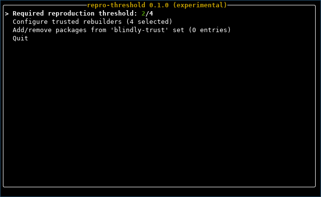
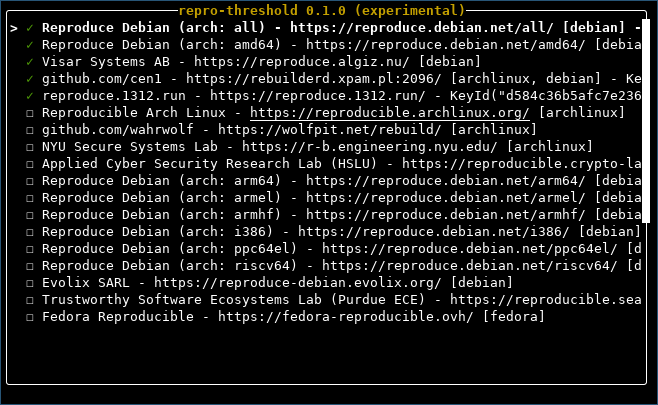
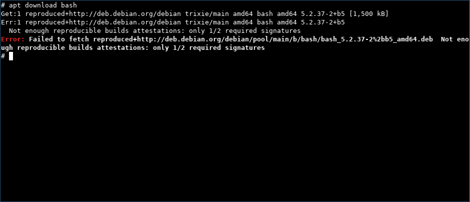

# repro-threshold

Threshold-based Reproducible Builds pluggable transport using your trusted rebuilders.



Run `repro-threshold` with no arguments to start a
[`ratatui`](https://github.com/ratatui/ratatui) based configuration interface.

**Status**: Very experimental

## Why this exists

- Open Source gives you the source code and often also provides prebuilt binaries
- You have to trust the build server (and their operators) that they've actually used this source code with no modifications
- There is an [ongoing effort](https://reproducible-builds.org/) to make the build deterministic and documented so other people can reproduce those binaries
- With `repro-threshold` you can enforce a policy to only install packages reproduced by multiple groups you trust

## Who to trust?



Who you trust to do this verification is a very personal choice and there's no
obvious right or wrong. This is why `repro-threshold` let's you configure this
yourself, along with the number of required groups having confirmed the binary.

There's a [public list of groups](https://github.com/kpcyrd/rebuilderd-community),
this can automatically be loaded by pressing `ctrl+R` in the rebuilder selection
screen of the TUI.

The trust necessary to the individual rebuilder is limited, most importantly:

> Out of the rebuilders you select,
>
> and the threshold configured,
>
> you trust no group is going to collude
>
> big enough to exceed your threshold.

If necessary, you can also always run your own.

The security control by `repro-threshold` is additive, this means even if it
gets fully bypassed/broken somehow, you won't be worse off than without it.

## What is the 'blindly trust' set?

As of this writing, it's currently not practical/possible to build a Debian/Arch
Linux computer with reproducible-only packages, so there's a mechanism to
exclude packages from this check and permit installation even if there's no
evidence it was built from the given source code.

## What this doesn't fix

The Reproducible Builds stack gives you a trusted path from source code to binary.

It doesn't help if the source code itself is malicious/harmful. The source code
may still contain security vulnerabilities or [intential
backdoors](https://en.wikipedia.org/wiki/XZ_Utils_backdoor). Choose wisely what
software you put into your computer.

## Privacy notes

The rebuilders you configure as trusted can see the packages and updates you are
interested in.

## Integration: alpm

⚠️ This hasn't been implemented yet

```
# /etc/pacman.conf
XferCommand=/usr/bin/repro-threshold transport alpm -O %o %u
```

## Integration: apt

Register repro-threshold as an available apt transport method:

```
ln -s /usr/bin/repro-threshold /usr/lib/apt/methods/reproduced+http
ln -s /usr/bin/repro-threshold /usr/lib/apt/methods/reproduced+https
```

Update your sources in /etc/apt/ to use this transport method:

```
#deb [arch=amd64] reproduced+http://deb.debian.org/debian unstable main

Types: deb
URIs: reproduced+http://deb.debian.org/debian
Suites: stable stable-updates
Components: main
Architectures: amd64
Signed-By: /usr/share/keyrings/debian-archive-keyring.gpg
```



## License

`Apache-2.0 OR MIT-0`
